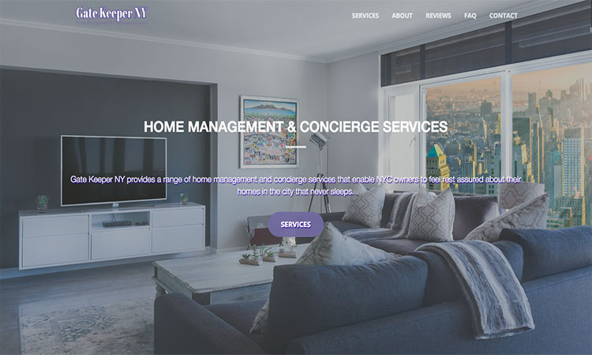

# [Gate Keeper NY](https://gatekeepernew.herokuapp.com/)

## Preview

## Download and Installation

To begin using this template, follow the methods to get started:
* Clone the repo: `git@github.com:Shesam1/GatekeeperNew.git`
* [Fork, Clone, or Download on GitHub](https://github.com/Shesam1/GatekeeperNew)

## About

Gate Keeper NY was built for Mary Lou who wanted a web presence to advertise her home management and concierge services in NYC. The client requested a one page site with the possibility of expansions in the future. The project was developed and executed in a total of 2 weeks.

## Copyright and License

Copyright 2018 built by Sherill Samuel for 17 Web Dev.
